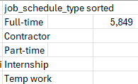
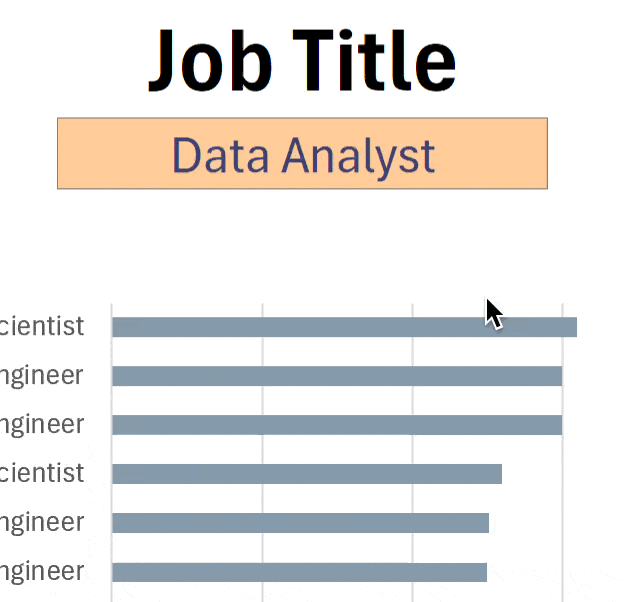

# Excel Salary Dashboard


## Introduction
This Excel dashboard was created to showcase my skills and learning journey in Excel. It highlights my ability to analyze, visualize, and interpret data effectively using Excel’s powerful features. The dashboard presents insights on job titles, salaries, locations, and key skills, demonstrating both my technical proficiency and analytical thinking.

### Dashboard File
My final dashboard is in [Project_1-Dashboard.xlsx](Project_1-Dashboard.xlsx).


### Excel Skills Used

The following Excel skills were utilized for analysis:

- **📉 Charts**
- **🧮 Formulas and Functions**
- **✅Data Validation**


### Data Jobs Dataset

The dataset used for this project contains real-world data science job information from 2023. The dataset is available via my Excel course, which provides a foundation for analyzing data using Excel. It includes detailed information on:

- **👨‍💼 Job titles**
- **💰 Salaries**
- **📍 Locations**
- **🛠️ Skills**


## Dashboard Build


### 📉 Charts

#### 📊 Data Science Job Salaries - Bar Chart


- 🛠️ **Excel Features:** Used bar charts with formatted salary values and optimized layout for clarity.
- 🎨 **Design Choice:** Chose horizontal bar charts to allow easy visual comparison of median salaries.
- 📉 **Data Organization:** Sorted job titles in descending order of salary for improved readability.
- 💡 **Insights Gained:** Quickly identifies salary trends, showing that senior roles and engineering positions typically pay more than analyst roles.

#### 📈 Job Type Distribution - Bar Chart


- 🛠️ **Excel Features:** Used a stacked bar chart to display different job types and their proportions.
- 🎨 **Design Choice:** Applied distinct colors for each job type to enhance visual distinction.
- 📊 **Data Representation:** Showed the distribution of Full-time, Part-time, Internship, and Contract roles.
- 👁️ **Visual Enhancement:** Optimized chart layout for clarity and easy comparison between job types.
- 💡 **Insights Gained:** Quickly identifies the most common job types and highlights trends in employment formats.

#### 🗺️ Country Median Salaries - Map Chart


- 🛠️ **Excel Features:** Leveraged Excel's map chart to visualize median salaries across countries.
- 🎨 **Design Choice:** Applied color-coding to easily differentiate salary levels by region.
- 📊 **Data Representation:** Displayed median salaries for all available countries.
- 👁️ **Visual Enhancement:** Enhanced readability for immediate comprehension of geographic salary patterns.
- 💡 **Insights Gained:** Quickly identifies global salary disparities and highlights regions with high or low pay.


### 🧮 Formulas and Functions

#### 💰 Median Salary by Job Titles

```
=MEDIAN(
IF(
    (jobs[job_title_short]=A2)*
    (jobs[job_country]=country)*
    (ISNUMBER(SEARCH(type,jobs[job_schedule_type])))*
    (jobs[salary_year_avg]<>0),
    jobs[salary_year_avg]
)
)
```

- 🔍 **Multi-Criteria Filtering:** Checks job title, country, schedule type, and excludes blank salaries.
- 📊 **Array Formula:** Utilizes `MEDIAN()` function with nested `IF()` statement to analyze an array.
- 🎯 **Tailored Insights:** Provides specific salary information for job titles, regions, and schedule types.
- **🔢 Formula Purpose:** This formula populates the table below, returning the median salary based on job title, country, and type specified.

**Background Table**


📉 Dashboard Implementation


#### ⏰ Count of Job Schedule Type


```
=FILTER(J2#,(NOT(ISNUMBER(SEARCH("and",J2#))+ISNUMBER(SEARCH(",",J2#))))*(J2#<>0))
```

- 🔍 **Unique List Generation:** This Excel formula below employs the `FILTER()` function to exclude entries containing "and" or commas, and omit zero values.
- **🔢 Formula Purpose:** This formula populates the table below, which gives us a list of unique job schedule types.
Background Table



📉 Dashboard Implementation:


### ❎ Data Validation

#### 🔍 Filtered List
- 🔒 **Enhanced Data Validation:** Implementing the filtered list as a data validation rule under the `Job Title`, `Country`, and `Type` option in the Data tab ensures:
    - 🎯 User input is restricted to predefined, validated schedule types
    - 🚫 Incorrect or inconsistent entries are prevented
    - 👥 Overall usability of the dashboard is enhanced




## Conclusion  

This Excel Salary Dashboard project demonstrates my ability to **analyze, visualize, and interpret real-world data** using Excel’s advanced features. Through creating interactive charts, map visualizations, and dynamic formulas, I was able to **derive meaningful insights** on job titles, salary distributions, employment types, and geographic trends.  

The project not only highlights my **technical proficiency in Excel** but also reflects my **analytical thinking and problem-solving skills**. It serves as a comprehensive example of how data can be transformed into actionable insights for informed decision-making in the field of data analysis.  

This dashboard is a testament to my **learning journey and dedication** to mastering Excel as a powerful tool for data-driven insights.

---
