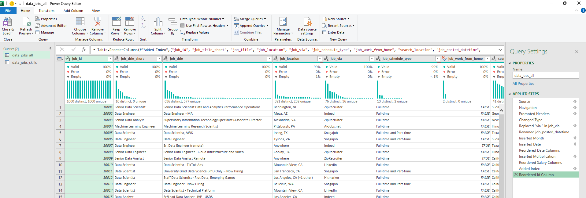
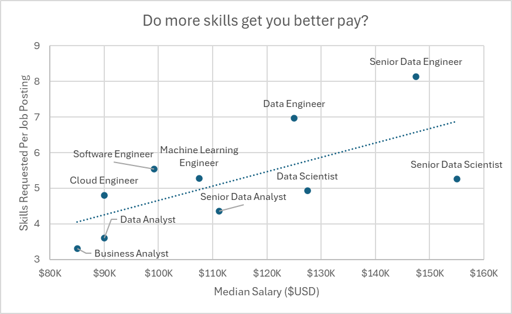
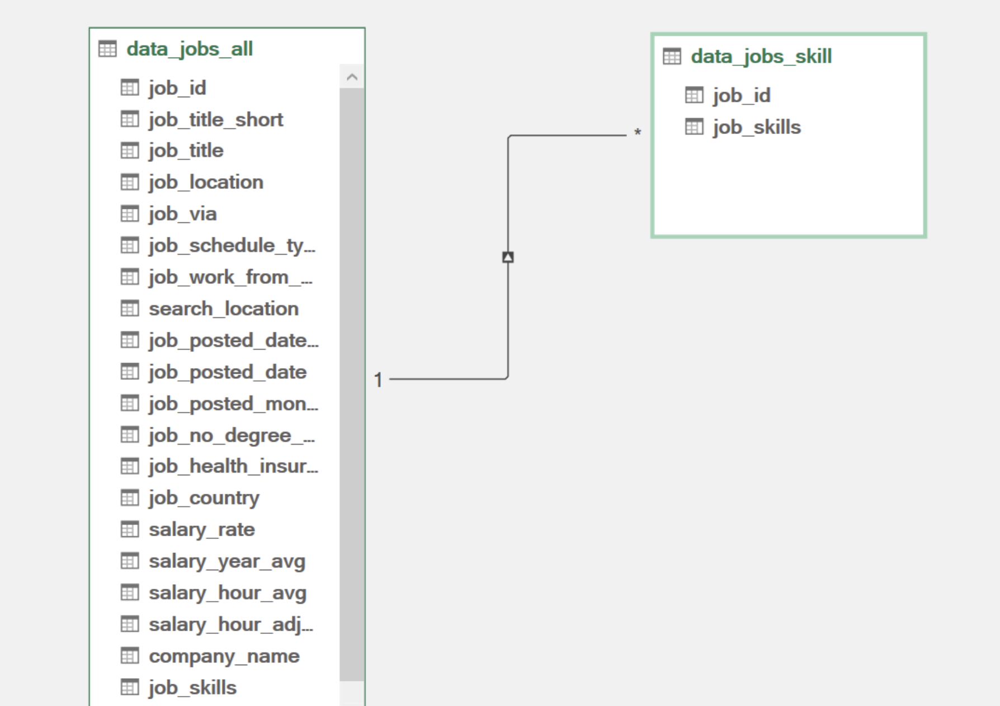

# Project 2 Analysis

## Introduction

This project reflects my journey in exploring the data science job market and understanding the skills and roles that drive career growth. By analyzing real-world job postings and salary data, I aimed to **apply my analytical skills and Excel knowledge** to uncover trends, identify high-demand skills, and provide insights that could help professionals make informed career decisions. This dashboard demonstrates both my **technical abilities and my capacity to interpret data** in a meaningful way.  

### Questions to Analyze
To explore trends in the data science job market, I focused on the following questions:

1. **Do more skills get you better pay?**  
2. **What’s the salary for data jobs in different regions?**  
3. **What are the top skills of data professionals?**  
4. **What’s the pay for the top 10 most in-demand skills?**

### ِAnalysis File
My final dashboard is in [Project_2-Analysis.xlsx](Project_2-Analysis.xlsx).

### Excel Skills Used

The following Excel skills were utilized for analysis:

- **📊 Pivot Tables**
- **📈 Pivot Charts**
- **🧮 DAX (Data Analysis Expressions)**
- **🔍 Power Query**
- **💪 Power Pivot**

### Data Jobs Dataset

The dataset used for this project contains real-world data science job information from 2023. The dataset is available via my Excel course, which provides a foundation for analyzing data using Excel. 

It includes detailed information on:

- **👨‍💼 Job titles**
- **💰 Salaries**
- **📍 Locations**
- **🛠️ Skills**

## 1️⃣ Do more skills get you better pay?

### Power Query (ETL)

- 📥 **Extract:** Used Power Query to extract original data and create queries for jobs and skills.  
- 🔄 **Transform:** Cleaned data, changed column types, removed unnecessary columns, and trimmed whitespace.  
- 🔗 **Load:** Loaded transformed data into the workbook as the foundation for analysis.  

**Screenshots:**  
- data_jobs_all   
- data_job_skills 

### 📊 Analysis
#### 💡 Insights

- 📈 There is a positive correlation between the number of skills requested in job postings and the median salary, particularly in roles like Senior Data Engineer and Data Scientist.
- 💼 Roles that require fewer skills, like Business Analyst, tend to offer lower salaries, suggesting that more specialized skill sets command higher market value.

    

    #### 🤔 So What

- This trend emphasizes the value of acquiring multiple relevant skills, particularly for individuals aiming for higher-paying roles.


## 2️⃣ What’s the salary for data jobs in different regions?

### 🧮 Skills: PivotTables & DAX

#### 📈Pivot Table

- 🔢 I created a PivotTable using the Data Model I created with Power Pivot.
- 📊 I moved the `job_title_short` to the rows area and `salary_year_avg` into the values area.
- 🧮 Then I added new measure to calculate the median salary for United States jobs.
    ```
    =CALCULATE(
        MEDIAN(data_jobs_all[salary_year_avg]),
        data_jobs_all[job_country] = "United States")
    ```

#### 🧮 DAX

- To calculate the median year salary I used DAX.

    ```
    Median Salary := MEDIAN(data_jobs_all[salary_year_avg])
    ```

### 📊 Analysis

#### 💡 Insights

- 💼 Job roles like Senior Data Engineer and Data Scientist command higher median salaries both in the US and internationally, showcasing the global demand for high-level data expertise.
- 💰 The salary disparity between US and Non-US roles is particularly notable in high-tech jobs, which might be influenced by the concentration of tech industries in the US.

    

    
#### **🤔 So What**

- These salary insights are important for planning and salary negotiations, helping professionals and companies align their offers with market standards while considering geographical variations.

## 3️⃣ What are the top skills of data professionals?

### 🔧 Skill: Power Pivot

#### 💪 Power Pivot

- 🔗 I created a data model by integrating the `data_jobs_all` and `data_jobs_skills` tables into one model.
- 🧹 Since I had already cleaned the data using Power Query; Power Pivot created a relationship between these two tables.

#### 🔗 Data Model

- I created a relationship between my two tables using the `job_id` column.

    

#### 📃 Power Pivot Menu

- The Power Pivot menu was used to refine my data model and makes it easy to create measures.

    

### 📊Analysis

#### 💡Insights

- 💻 SQL and Python dominate as top skills in data-related jobs, reflecting their foundational role in data processing and analysis.
- ☁️ Emerging technologies like AWS and Azure also show significant presence, underlining the industry's shift towards cloud services and big data technologies.

    

#### 🤔So What

- Understanding prevalent skills in the industry not only helps professionals stay competitive but also guides training and educational programs to focus on the most impactful technologies.


## 4️⃣ What’s the pay of the top 10 skills?


### 📊 Skill: Advanced Charts (Pivot Chart)

#### 📈 PivotChart

- I created a combo PivotChart to plot median salary and skill likelihood (%) from my PivotTable.
    -  **Primary Axis:** Median Salary (as a Clustered Column)
    -  **Secondary Axis:** Skill Likelihood (as a Line with Markers)
- To customize the chart, I added a title axis title, removed the lines (skill likelihood), and changed the markers to diamonds.


### 📊 Analysis

#### 💡Insights

- 💰 Higher median salaries are associated with skills like Python, Oracle, and SQL, suggesting their critical role in high-paying tech jobs.
- 📉 Skills like PowerPoint and Word have the lowest median salaries and likelihood, indicating less specialization and demand in high-salary sectors.

    

#### 🤔So What

- This chart highlights the importance of investing time in learning high-value skills like Python and SQL, which are evidently tied to higher paying roles, especially for those looking to maximize their salary in the tech industry.


## Conclusion

This project allowed me to explore the data science job market and uncover meaningful insights about skills, roles, and salaries. By leveraging Excel tools such as Power Query, Power Pivot, PivotTables, and advanced charts, I was able to transform raw data into actionable information. The analysis highlights the value of acquiring multiple high-demand skills, understanding regional salary differences, and focusing on technologies that drive higher-paying roles. Overall, this project showcases both my **technical proficiency** and my ability to **derive insights that support career growth and strategic decision-making** in the data science field.
